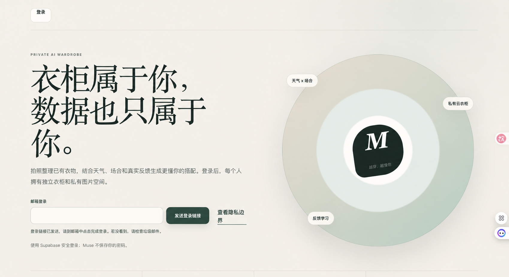
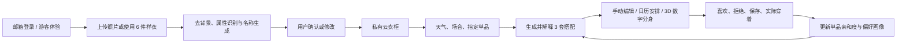
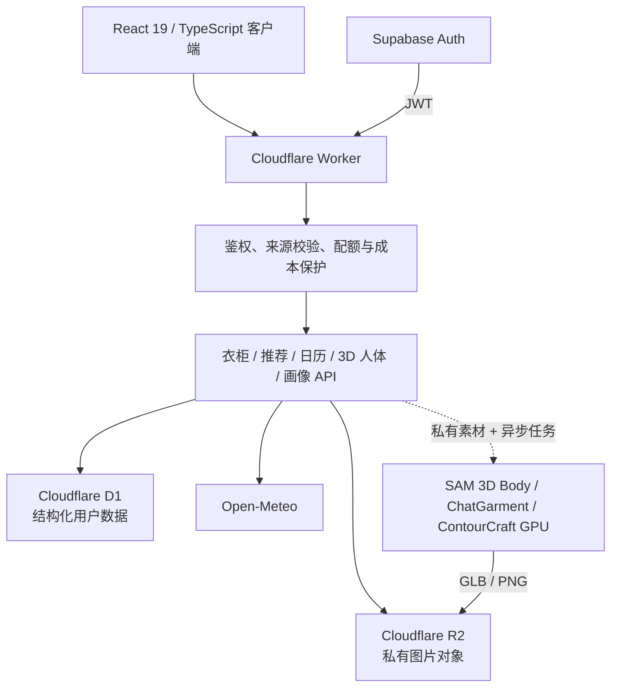

# Muse Closet

> 一个围绕“搭配困难、衣物容易被遗忘、衣柜与穿搭难以系统管理”构建的 AI 云衣柜产品项目。

[](https://www.typescriptlang.org/)
[](https://react.dev/)
[](https://workers.cloudflare.com/)
[](https://supabase.com/auth)

[在线体验](https://muse-closet-ai.2307551787.workers.dev/) · [Sites 备份](https://muse-closet-ai.jazzy-root-7273.chatgpt.site/) · [提交反馈](https://github.com/XinyuGao888/muse-closet-ai/issues)


Muse Closet 不只是“上传照片后生成三套穿搭”的展示页。它把衣物建档、衣柜管理、穿搭决策、3D 数字分身、真实穿着反馈和下一轮排序串成了一个可持续学习的产品闭环。

正式站支持邮箱魔法链接和无需邮箱的游客模式。每个账户或游客拥有独立的 D1 数据与私有图片空间；首次进入会获得 6 件演示单品，可以直接体验推荐、编辑、日历、反馈和 3D 搭配流程。

3D 数字分身页当前采用“零成本演示模式”：用户可以真实完成建档、选衣和互动 WebGL 搭配，同时查看明确标注来源的 ChatGarment 官方预生成效果基准。只有部署者配置 GPU 适配服务后，按钮才会切换为真实纸样、网格和布料模拟，页面不会把互动木偶描述成模型生成结果。

## 产品截图



> 截图中的个人邮箱已脱敏。线上版本另提供“无需邮箱，直接游客体验”入口。

## 30 秒体验路径

1. 打开[正式站](https://muse-closet-ai.2307551787.workers.dev/)，点击“无需邮箱，直接游客体验”。
2. 使用自动生成的 6 件样衣，查看天气与场合驱动的 3 套推荐。
3. 编辑其中一套搭配，或进入“3D 数字分身”上传一张全身照并选择衣物。
4. 点击喜欢、拒绝、保存或实际穿着，观察偏好信号和后续排序发生变化。
5. 进入日历、衣橱洞察、自由搭配、买不买助手和人体档案继续体验。
6. 点击“退出”，游客的临时业务数据和匿名登录身份会被删除。

## 核心功能流程



## 已实现能力

### 日常穿搭闭环（P0）

- 云衣柜搜索、筛选、收藏、穿着次数、存放位置和七种可用状态
- 根据天气、场合、正式度、指定单品与偏好生成 3 套可解释搭配
- 自然语言穿搭入口与浏览器语音输入
- 月历缩略图、拖动安排日期、一键生成下周一至周五 5 套穿搭
- 洗衣、借出、维修等不可用单品自动排除推荐
- 批量上传、任务状态、候选审核、封面选择与单件重识别
- 自然比例 3D 人体、手动选衣和 Style Twin 立体搭配
- 颜色、品类、季节、闲置单品、组合参与度和基础款缺口分析

### 产品差异化（P1）

- 自由搭配画布：移动、缩放、旋转、层级与 Outfit Card 保存
- 单品关系网络：历史搭配、常用场合、共现单品和 3 个新搭法
- “买不买”助手：重复度、搭配潜力、替代品、推荐尺码和购买建议
- 自动定位天气、前一晚提醒、天气变化提醒和早晨重新排序
- 真人穿搭日记：把自拍、计划搭配与真实反馈关联

### 多源建档与偏好学习（P2）

- 图片、吊牌 OCR、条码/二维码和商品链接四种建档入口
- 保存品牌、货号、来源链接、原始识别文字与商品图片候选
- 上装、下装、连衣裙、外套、鞋履和配饰的 3D 分层搭配
- 灵感穿搭库、显式偏好、屏蔽颜色、版型偏好和探索度设置
- 喜欢 `+1.5`、拒绝 `-2.5`、保存 `+2.5`、实际穿着 `+4` 的差异化反馈权重

### 人体档案与风格映射（P3）

- 单张正面全身照优先的人体档案入口，侧面照仅作为可选增强；不上传照片时可改用 5 项身体参数
- 可旋转的比例人体预览；用户只需输入身高、体重和胸腰臀三围，其余比例由系统推算
- 上装、下装与外套分层选择，连衣裙与上下装冲突自动处理
- 私有全身照、侧面照和衣物原图以 multipart 方式发送给 GPU 服务，支持异步进度、失败回退和结果恢复
- GPU 返回的 GLB/渲染结果由 Worker 拉回用户私有 R2 空间，不直接公开用户生成资产
- Style Twin 将灵感中的配色、比例、层次和场景语言映射到用户衣柜
- Three.js 实时 WebGL 人体和服装版型预览，并提供 SAM 3D Body、MHR、ChatGarment 与 ContourCraft 适配边界

## 真实技术边界

这个仓库刻意区分“已经真实运行的能力”“稳定降级能力”和“需要外部模型服务的接口”，避免把界面原型描述成已经落地的模型效果。

| 能力 | 当前仓库真实状态 | 接入外部服务后 |
| --- | --- | --- |
| 登录与多用户隔离 | Supabase 邮箱/匿名登录；Worker 校验 JWT；D1 查询绑定 `user_id` | 可继续增加 Google、Apple、微信等身份提供商 |
| 衣柜数据与图片 | 结构化记录真实写入 D1；图片真实写入 R2 并通过鉴权 API 读取 | 可接对象生命周期、CDN 变体与内容审核 |
| 衣物识别 | 未配置模型时根据文件名和浏览器提取结果生成可审核候选，不等同真实视觉识别 | 配置 `FASHION_SIGLIP_URL` 后调用 FashionSigLIP 兼容服务 |
| 去背景 | 浏览器端对纯净背景执行轻量处理，复杂背景效果有限 | 可替换为专用分割或抠图服务 |
| 穿搭推荐 | 当前是可解释的规则排序与反馈加权，不是大模型自由生成 | 可在适配层加入 LLM/排序模型，但仍保留规则兜底 |
| 天气 | 真实调用 Open-Meteo；失败时返回稳定的本地天气降级数据 | 可替换为商业天气源 |
| OCR、条码、商品导入 | 已有完整表单、数据结构和适配接口；无服务时仅提供可审核降级结果 | 分别配置 OCR、条码解析与电商导入服务 |
| 3D 人体与服装 | 单张全身照/5 项参数建档、分层选衣、异步任务、私有素材传输、R2 结果回收和 Three.js 降级预览均已实现；公开站的预览不是精确扫描或物理布料仿真 | 可通过 `SAM3D_BODY_URL`、`MHR_URL` 与仓库内的 ChatGarment GPU adapter 接入人体重建、版型生成和 ContourCraft 布料模拟 |
| 提醒 | 浏览器开启期间使用 Web Notification；不是原生 App 的后台推送 | 可增加 Push API、消息队列和移动端推送 |

公开演示环境没有配置 FashionSigLIP、SAM 3D Body、MHR 或 GARMENT 3D 的付费推理密钥，因此会明确展示浏览器 WebGL 或规则降级模式。这样既能让项目始终可体验，也不会把未发生的模型调用写成“真实 AI 效果”。

## 零成本 3D 验证策略

1. 游客和面试官默认使用预生成基准样例与互动 WebGL，不触发 GPU 费用。
2. 使用 Kaggle/Colab 免费 GPU 仅验证官方示例和生成无隐私样例，不将 Notebook 暴露为生产 API。
3. 真实链路跑通后优先使用按秒计费、可缩容到 0 的 GPU 服务；每用户预算和全站预算在 Worker 端双重限制。
4. 拥有兼容 NVIDIA 显卡的高级用户未来可以接入 Local Runner；普通浏览器和 Apple Silicon 仍使用网页体验。

完整的免费验证步骤和上线验收条件见 [`docs/FREE_GPU_VALIDATION.md`](./docs/FREE_GPU_VALIDATION.md)。第三方基准图片及许可证说明见 [`THIRD_PARTY_NOTICES.md`](./THIRD_PARTY_NOTICES.md)。

## 技术架构



主要技术栈：

- Vinext、React 19、TypeScript 5.9
- Cloudflare Workers、D1、R2
- Supabase Auth（邮箱魔法链接与匿名登录）
- Drizzle Schema + 原生 D1 Prepared Statements
- Three.js、WebGL 参数人体、Web Notification、Geolocation 与浏览器端图像处理
- Node Test Runner、ESLint、TypeScript 类型检查

## 数据与隐私边界

- 所有业务表都带用户标识，所有读写在服务端绑定当前认证用户。
- R2 对象使用用户专属路径；图片不暴露公开桶地址，私有读取返回 `private, no-store`。
- Worker 拒绝未登录 API、跨站写请求和过大的请求体，并设置防嵌入与 MIME 嗅探保护头。
- 外部 AI 图片处理默认关闭，只有用户主动同意且部署者配置服务后才会发送所选图片。
- 默认限制单张图片 8MB、每用户每日 40 个上传文件、100MB 上传量和 20 次模型调用。
- 同时限制全站每日模型调用与估算预算，避免公开链接被滥用后产生失控成本。
- 账户页可以删除全部 D1 记录、用户专属 R2 图片和 Supabase 登录身份。
- 游客点击“退出”时会执行同一套删除流程；仅关闭标签页不会立即删除临时身份。

## 本地运行

要求：Node.js `>=22.13.0`、pnpm `>=11`。

```bash
git clone https://github.com/XinyuGao888/muse-closet-ai.git
cd muse-closet-ai
corepack enable
pnpm install
pnpm run dev
```

打开 `http://localhost:3000`。本地环境默认使用隔离的 `demo-user`，并由 Miniflare 提供 D1/R2；首次访问会自动建表并写入演示数据，不要求 Supabase 或外部模型密钥。

常用命令：

```bash
pnpm run dev                 # 本地开发
pnpm run build               # 生产构建
pnpm exec tsc --noEmit       # 类型检查
pnpm run lint                # 代码检查
pnpm test                    # 构建 + 7 项自动化测试
pnpm run check:cloudflare    # Cloudflare 部署前 dry-run
```

## 配置真实服务

复制环境变量示例：

```bash
cp .env.example .env.local
```

最小的线上身份配置：

| 变量 | 作用 |
| --- | --- |
| `AUTH_PROVIDER` | 线上部署设为 `supabase` |
| `SUPABASE_URL` | Supabase 项目地址 |
| `SUPABASE_PUBLISHABLE_KEY` | 可以在浏览器公开的 publishable/anon key |
| `SUPABASE_SECRET_KEY` | 仅服务端使用，用于账户删除；必须存入平台 Secret，禁止提交 |

可选模型与数据服务：

| 变量 | 作用 |
| --- | --- |
| `FASHION_SIGLIP_URL` / `FASHION_SIGLIP_TOKEN` | 衣物属性识别 |
| `OCR_BARCODE_URL` / `OCR_BARCODE_TOKEN` | 吊牌 OCR 与条码解析 |
| `PRODUCT_IMPORT_URL` / `PRODUCT_IMPORT_TOKEN` | 官网或电商商品元数据导入 |
| `BATCH_SEGMENT_URL` / `BATCH_SEGMENT_TOKEN` | 一张照片拆分多件衣物 |
| `OUTFIT_DIARY_VISION_URL` / `OUTFIT_DIARY_VISION_TOKEN` | 真人穿搭视觉分析 |
| `SAM3D_BODY_URL` / `SAM3D_BODY_TOKEN` | 照片到 3D 人体重建 |
| `MHR_URL` / `MHR_TOKEN` | 参数化 MHR 人体网格 |
| `GARMENT_3D_URL` / `GARMENT_3D_TOKEN` | ChatGarment/ContourCraft 适配服务；接收私有原图并异步返回组合后的 GLB 网格 |
| `GARMENT_3D_RESULT_HOSTS` | 可选的逗号分隔 HTTPS 结果域名白名单；适配服务自身域名默认允许 |
| `STYLE_TWIN_URL` / `STYLE_TWIN_TOKEN` | 灵感理解与个性化重排 |

所有 Token 都应放入本地未跟踪环境文件或 Cloudflare Secret。`.env.example` 只包含占位值。

## 部署到 Cloudflare

1. 创建 D1 数据库与 R2 Bucket。
2. 将自己的数据库 ID、Bucket 名称和 Supabase 公开配置写入 `wrangler.cloudflare.jsonc`。
3. 在 Supabase 开启邮箱登录；需要游客模式时同时开启 Anonymous Sign-Ins，并配置正式站 Redirect URL。
4. 将 Supabase secret 写入 Cloudflare，而不是代码仓库。
5. 构建、检查并部署。

```bash
pnpm exec wrangler d1 create muse-closet-ai-db
pnpm exec wrangler r2 bucket create muse-closet-ai-images
pnpm exec wrangler secret put SUPABASE_SECRET_KEY --config wrangler.cloudflare.jsonc
pnpm run check:cloudflare
pnpm run deploy:cloudflare
```

线上不会回退到共享 `demo-user`；没有有效 JWT 的个人 API 请求会返回 `401`。

## 项目结构

```text
app/
  api/                  # 衣柜、推荐、日历、3D 人体、画像、隐私等接口
  wardrobe-app.tsx      # 登录后的主要产品壳与数据编排
  p0-views.tsx          # 日历、批量建档、衣橱洞察
  p1-views.tsx          # 自由画布、购物助手、提醒、真人日记
  advanced-views.tsx    # 人体档案、灵感穿搭、Style Twin
db/                     # D1 运行时建表与 Drizzle Schema
drizzle/                # 数据库迁移
lib/                    # 推荐、反馈、配额、安全与服务端逻辑
services/chatgarment-adapter/ # 可部署到 NVIDIA GPU 主机的异步模型适配服务
docs/FREE_GPU_VALIDATION.md   # Kaggle/Colab 免费 GPU 验证与上线验收清单
worker/                 # Cloudflare Worker、JWT 校验与安全边界
tests/                  # 构建结果和安全能力回归测试
docs/screenshots/       # README 展示图片
```

## 面试讲解主线

1. 先把“我有哪些衣服”从非结构化照片变成可检索、可计算的数据资产。
2. 再把天气、场合、指定单品和衣物可用状态组合成可解释排序，而不是只生成文案。
3. 用强弱不同的真实反馈更新单品亲和度，让下一次结果可验证地变化。
4. 将高成本模型全部放到可替换适配层后面，默认提供明确降级，保证 Demo 始终可运行。
5. 通过登录隔离、图片私有访问、限额、成本保护和账户删除，把原型推进到可公开体验的产品版本。

## 说明

本项目目前以个人作品与产品验证为目的。公开代码不附带第三方模型、品牌、电商平台或图片素材的商业授权；将其用于商业环境前，请自行确认数据、模型和内容许可。
