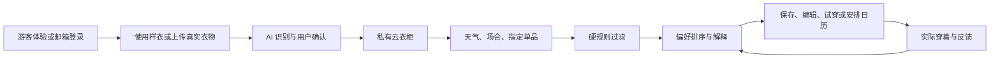

# Muse Closet 产品需求文档（PRD）

> 文档版本：v1.0  
> 更新日期：2026-08-28  
> 产品阶段：可公开体验的个人 AI 产品 Demo  
> 正式体验地址：https://muse-closet-ai.2307551787.workers.dev/  
> GitHub：https://github.com/XinyuGao888/muse-closet-ai

## 1. 文档目的

本文档用于统一 Muse Closet 的用户问题、产品范围、核心流程、AI 方案、评测方法、数据指标和迭代优先级。它既是后续开发依据，也用于产品评审、朋友体验反馈和面试讲解。

文档只描述两类内容：

1. 已经可以在正式站真实体验的能力。
2. 已明确边界、尚待接入外部模型或验证的规划能力。

不把静态界面、降级结果或技术研究描述成已经上线的 AI 能力。

## 2. 产品概述

### 2.1 一句话定义

Muse Closet 是一个会记录真实衣物、理解当天需求，并通过穿着反馈持续调整推荐的私人 AI 云衣柜。

### 2.2 用户问题

核心痛点不是单纯“衣服很多”，而是三个问题同时存在：

- 搭配困难：面对天气、场合和个人偏好时，不知道哪些衣服应该组合。
- 单品遗忘：衣服增多后，被遮挡或长期未穿的单品逐渐退出记忆。
- 缺少系统管理：衣物状态、穿着记录、搭配计划和购买判断分散在记忆、相册与购物平台中。

### 2.3 产品假设

如果产品能够把真实衣物转化为结构化衣柜，并在每天需要做决定的时刻给出少量、可解释、可直接执行的搭配，那么用户会从“偶尔试一下 AI”转向“每天计划和记录穿搭”。

### 2.4 核心价值

- 看得见：记住用户真正拥有的衣服。
- 搭得对：结合场合、天气、比例和偏好，优先排除不成立的组合。
- 试得到：用真人照片验证单件衣物的大致视觉效果。
- 越用越懂：从喜欢、拒绝、保存和实际穿着中学习。

## 3. 目标用户与场景

### 3.1 主要用户

#### A. 衣物较多但缺乏系统管理的人

- 衣柜中有大量相似单品。
- 经常只穿最顺手的少数几件。
- 买衣服时容易忘记已有替代品。

#### B. 每天有明确场合要求的人

- 上班、见客户、约会、聚会、旅行等场景频繁切换。
- 需要兼顾天气、正式度和舒适度。
- 希望减少早晨搭配决策时间。

#### C. 愿意尝试 AI，但要求结果真实可解释的人

- 不满足于随机生成一句建议。
- 希望知道“为什么推荐”和“哪里可能不合适”。
- 愿意通过实际穿着反馈帮助系统学习。

### 3.2 暂不优先服务

- 需要专业服装打版、精确尺码或真实布料物理仿真的用户。
- 只想浏览电商商品、不愿建立个人衣柜的用户。
- 需要多人共享家庭衣柜或服装租赁库存管理的机构用户。

### 3.3 核心 Jobs To Be Done

| 场景 | 用户任务 | 期望结果 |
| --- | --- | --- |
| 早晨出门前 | 快速决定今天穿什么 | 1–3 套可直接执行的方案 |
| 购买新衣前 | 判断是否与现有衣柜重复 | 看见替代品和可组成搭配数量 |
| 整理衣柜时 | 记住拥有的单品及状态 | 可搜索、筛选、统计的云衣柜 |
| 一周开始前 | 提前安排工作日穿搭 | 根据每天不同天气生成计划 |
| 想尝试陌生单品时 | 预览穿在真人身上的大致效果 | 真实生成的 Before / After |
| 穿完之后 | 记录真实感受并修正推荐 | 下一次排序发生可解释变化 |

## 4. 产品原则

1. **宁缺毋滥：** 不为了凑满三套而重复组合或加入场合冲突单品。
2. **真实边界：** 没有模型结果就显示不可用，不展示木偶或贴图冒充生成。
3. **用户确认优先：** AI 识别的名称和属性必须允许修改后再入柜。
4. **渐进式复杂度：** 一级导航只保留高频任务，高级参数按需展开。
5. **反馈靠近行为：** 保存、实际穿着等行为比口头偏好拥有更高权重。
6. **隐私与成本默认受控：** 图片私有、外部 AI 默认需授权、模型调用有限额。

## 5. 成功指标

### 5.1 北极星指标

每周完成至少一次“保存搭配”或“实际穿着记录”的活跃用户数。

该指标同时要求推荐产生价值，并形成真实行为闭环，而不是只浏览页面。

### 5.2 漏斗指标

| 阶段 | 指标 | 第一阶段建议目标 |
| --- | --- | --- |
| 进入 | 游客或登录成功率 | ≥ 95% |
| 建立价值 | 首次进入后 3 分钟内看到有效推荐 | ≥ 80% |
| 推荐接受 | 推荐保存率 | ≥ 20% |
| 行为转化 | 保存后 7 天内标记实际穿着 | ≥ 25% |
| 反馈学习 | 产生至少一个明确反馈的用户占比 | ≥ 30% |
| 试穿 | 有效提交后的模型生成成功率 | ≥ 90% |
| 留存 | 7 日内再次查看衣柜或推荐 | 验证期观察，不提前承诺 |

### 5.3 质量与成本指标

- 推荐硬冲突率：目标 < 3%。
- 三套推荐基础组合重复率：目标 < 10%。
- 真人试穿非目标区域明显漂移率：分品类统计。
- 模型生成 P95 时延、单次平均成本、失败重试率。
- 每日人均模型调用次数和全站预算消耗。

## 6. 信息架构

### 6.1 一级导航

- 今日：天气、自然语言入口、有效搭配、下周计划。
- 衣柜：搜索、筛选、收藏、状态和单品详情。
- AI 试穿：真人照片、单件衣物选择、生成结果与历史。
- 我的记录：真实穿搭照片、计划关联和穿着反馈。

### 6.2 更多功能

- 穿搭日历
- 自由搭配
- 搭配实验室
- 灵感穿搭库
- 买不买助手
- 建档任务
- 衣橱洞察

高级能力不与每日主流程竞争注意力。

## 7. 核心用户流程

### 7.1 首次体验流程

1. 用户点击“无需邮箱，直接游客体验”。
2. 系统创建独立匿名身份、D1 数据空间和私有图片路径。
3. 自动加入 6 件许可清晰的演示单品。
4. 今日页根据天气和通勤场合展示通过校验的推荐。
5. 用户可以保存、编辑、标记穿着或进入 AI 试穿。
6. 游客主动退出时，删除临时业务数据和匿名身份。

### 7.2 真人试穿流程

1. 用户开启“允许外部 AI 图片处理”。
2. 上传或选择一张真人照片。
3. 从个人云衣柜选择一件有原图的衣物。
4. 系统检查输入、额度和服务状态。
5. 服务端发送私有输入，拉回模型结果并写入用户专属 R2。
6. 页面展示试穿前后对比与历史记录。

## 8. 功能需求与验收标准

### FR-01 身份与游客体验（P0）

**需求**

- 支持 Supabase 邮箱魔法链接登录。
- 支持无需邮箱的匿名游客模式。
- 不同身份的数据和图片严格隔离。
- 游客退出和账户删除均可清理数据。

**验收标准**

- 未认证用户访问个人 API 返回 `401`。
- 用户 A 无法读取或修改用户 B 的衣物和图片。
- 删除账户后，相关业务表、R2 对象和认证身份被删除。

### FR-02 衣物建档（P0）

**需求**

- 支持单张照片上传。
- 自动生成可编辑的名称、类别、颜色、材质、季节、风格和场合标签。
- 用户确认或修改后再存入云衣柜。
- 支持轻量去背景；复杂背景明确提示能力边界。

**验收标准**

- 图片与结构化信息均归属当前用户。
- 识别失败时保留原图并允许重新生成或手动填写。
- 单张图片大小和每日上传量受到限制。

### FR-03 云衣柜管理（P0）

**需求**

- 搜索名称、颜色、材质、品牌、货号和风格标签。
- 按品类、收藏和衣物状态筛选。
- 记录穿着次数、最近穿着日期和存放位置。
- 状态包括：可穿、已穿待洗、清洗中、晾晒中、收纳中、借出、维修中。

**验收标准**

- 不可用衣物自动排除推荐。
- 收藏和穿着记录保存后刷新页面仍然存在。
- 衣物卡片默认保持简洁，高级信息按需展开。

### FR-04 每日穿搭推荐（P0）

**需求**

- 输入天气、场合、正式度和指定单品。
- 输出最多 3 套有效、可解释且基础组合不同的方案。
- 允许用户手动增删单品并保存。
- 衣柜不足时返回少于 3 套，并说明缺少的品类。

**硬规则**

- 连衣裙不能与普通上装、下装同时作为基础结构。
- 核心单品必须与场合直接或相邻兼容。
- 低温缺少保暖层、高温强加外套的组合不得通过。
- 同时放大上下量感、多个强图案或多个无主次强调色需要降分或过滤。
- 仅增减配饰但基础单品相同，不得算作新的推荐。

**软排序**

- 风格家族一致性。
- 单一强调色与中性色托底。
- 收藏、亲和度、穿着次数和显式偏好。
- 喜欢、拒绝、保存和实际穿着的反馈权重。

**验收标准**

- 通勤场景不得推荐仅适合聚会或浪漫约会的裙装来凑数。
- 推荐理由必须点名基础单品，并解释比例、温度或色彩判断。
- 推荐分数不得全部机械封顶。

### FR-05 自然语言与语音入口（P0）

**需求**

- 支持“明天见客户，伦敦下雨，希望正式但不要像销售”等自然语言。
- 提取日期、地点、天气、场合、正式度、颜色和指定单品。
- 浏览器支持时可用语音转文字。

**验收标准**

- 页面展示系统理解出的关键条件。
- 无法识别语音时可以继续使用文字，不阻断主流程。

### FR-06 穿搭日历（P0）

**需求**

- 月历中展示每日搭配缩略图。
- 电脑端拖动搭配到日期，手机端点击选择后安排。
- 一次生成下周一至周五计划，并按每天不同天气调整。
- 当天一键标记实际穿着。

**验收标准**

- 日历计划刷新后保留。
- 标记穿着后，单品穿着次数和可用状态同步变化。

### FR-07 真人 AI 试穿（P0）

**需求**

- 支持真人全身照和单件上装、下装、连衣裙或外套。
- 生成中展示明确状态，失败时允许原地重试。
- 展示 Before / After，并保存最近试穿历史。
- 外部 AI 处理必须先获得用户同意。

**验收标准**

- 无模型密钥或额度时明确提示，不展示伪造结果。
- 结果图片保存到当前用户私有空间。
- 当前结果明确标注为视觉参考，不等同尺码或物理仿真。

### FR-08 反馈与偏好学习（P0）

**需求**

- 收集喜欢、拒绝、保存和实际穿着。
- 用户手动编辑搭配视为强偏好信号。
- 反馈影响下一次排序。

**当前权重**

- 喜欢：`+1.5`
- 拒绝：`-2.5`
- 保存：`+2.5`
- 实际穿着：`+4`

**验收标准**

- 每次反馈只作用于当前用户。
- 下一轮排序可观察到对应单品亲和度变化。

### FR-09 衣柜洞察与购买判断（P1）

**需求**

- 展示常穿、长期未穿、品类占比、搭配参与度和基础款缺口。
- 买不买助手判断重复度、替代品、搭配潜力和偏好适配。

**验收标准**

- 建议必须引用当前衣柜数据，而不是只输出通用购物文案。
- 缺少真实尺码模型时，推荐尺码必须标明为估算。

### FR-10 批量建档与多源导入（P1/P2）

**需求**

- 支持多图批量上传、任务状态、批量确认和单件重识别。
- 预留吊牌 OCR、条码和商品链接导入适配层。

**验收标准**

- 未配置外部服务时使用可审核降级，不伪造品牌和货号。
- 每件衣物都有独立处理状态和失败原因。

## 9. AI 产品方案

### 9.1 为什么不是一个全能 Agent

衣柜主流程包含高频、结构化且需要稳定结果的任务。第一阶段采用“确定性工作流＋可替换模型能力”，而不是让单个 Agent 自由决策所有步骤：

| 任务 | 当前方案 | 原因 |
| --- | --- | --- |
| 衣物属性识别 | 视觉模型适配层＋用户确认 | 允许替换模型，并保留人工纠错 |
| 搭配推荐 | 规则过滤＋偏好排序 | 需要稳定、可解释、可回归测试 |
| 自然语言理解 | 轻量意图抽取＋规则映射 | 输入开放，但输出字段明确 |
| 真人试穿 | 专用 VTON 模型 | 通用 LLM 不适合像素级生成 |
| 反馈学习 | 显式权重更新 | 数据量小，先验证信号有效性 |
| 多步骤建档 | 工作流/任务队列 | 需要状态、重试和人工审核 |

Agent 更适合后续用于跨能力编排，例如“为下周出差生成五天计划、检查缺失单品并提出购买建议”，但每一步仍需调用可验证的专用工具。

### 9.2 推荐链路

1. 过滤不可用衣物。
2. 生成“连衣裙”或“上装＋下装”基础组合。
3. 添加可选外套、鞋履和配饰。
4. 运行结构、场合、温度和比例硬校验。
5. 计算风格、色彩、完整度和个人偏好分数。
6. 用组合相似度去重。
7. 输出最多 3 套并生成具体解释。

### 9.3 公开穿搭内容的使用边界

- 当前只归纳公开时尚编辑内容中的通用搭配原则。
- 不抓取小红书或博主图片训练模型。
- 不把虚构人物包装为真实达人。
- 后续如建立达人灵感库，需获得数据许可，并保存来源、场合、单品结构、色盘、比例和审核状态。

## 10. AI 评测方案

### 10.1 推荐离线评测集

按以下维度构建固定测试集：

- 场合：通勤、会议、约会、周末、正式活动。
- 温度：低温、过渡季、高温、雨雪。
- 衣柜结构：完整、缺少鞋履、缺少下装、只有裙装、单品重复。
- 指定单品：普通基础款、场合冲突款、不可用状态款。
- 偏好：明确喜欢、明确拒绝、无历史数据。

### 10.2 推荐评测指标

- 结构正确率。
- 场合兼容率。
- 温度合理率。
- 三套基础组合差异率。
- 推荐解释与实际组合一致率。
- 人工造型师或目标用户的接受率。
- 保存率、编辑率和实际穿着率。

### 10.3 真人试穿评测维度

- 身份保持：脸、发型、肤色是否稳定。
- 姿势保持：身体姿态和构图是否改变。
- 目标衣物保持：颜色、领型、袖型、长度和纹理。
- 非目标区域漂移：裤子、鞋子、背景是否被无关修改。
- 遮挡与边缘：手臂、头发、包和衣服边界是否自然。
- 可用性：生成时延、失败率和重试成功率。

### 10.4 Bad Case 分类

| 编号 | 类型 | 示例 | 优先级判断 |
| --- | --- | --- | --- |
| REC-01 | 结构冲突 | 连衣裙同时搭普通上装和下装 | P0，直接影响可信度 |
| REC-02 | 场合冲突 | 聚会长裙进入日常通勤首选 | P0，影响核心决策 |
| REC-03 | 重复凑数 | 三套只增减围巾 | P0，影响推荐价值 |
| REC-04 | 温度冲突 | 高温搭厚外套 | P0，影响可执行性 |
| REC-05 | 解释不一致 | 文案说低饱和，组合有多个高饱和色 | P1 |
| VTON-01 | 身份漂移 | 面部或体型明显改变 | P0 |
| VTON-02 | 非目标漂移 | 试穿外套时裤装颜色改变 | P1/P0，视严重度 |
| VTON-03 | 衣物失真 | 花纹、长度或版型改变 | P0 |
| VTON-04 | 遮挡异常 | 手臂穿过衣物或边缘破碎 | P0 |

## 11. 非功能需求

### 11.1 隐私与安全

- 所有数据读写绑定服务端认证用户。
- 图片存入私有 R2，通过鉴权 API 返回。
- 外部 AI 处理默认关闭，需用户主动同意。
- 拒绝跨站写请求、过大请求和伪造身份头。
- 提供完整账户与数据删除能力。

### 11.2 成本控制

- 每用户每日上传次数和容量限制。
- 每用户、全站模型调用次数和预算限制。
- 输入不完整时禁止提交模型请求。
- 失败后保留输入，避免用户重复上传。

### 11.3 性能与可用性

- 普通衣柜操作应在 1 秒级得到反馈。
- 模型调用异步展示状态，目标 15–30 秒完成试穿。
- 外部服务失败不影响衣柜、推荐和记录等基础能力。
- 切换页面或返回浏览器标签后保留当前模块和滚动位置。

### 11.4 可访问性与响应式

- 主要按钮有明确文字或可访问标签。
- 核心流程支持桌面与移动端。
- 状态变化不能只依赖颜色表达。

## 12. 数据对象

主要数据对象包括：

- 用户与隐私授权
- 衣物与衣物来源
- 搭配与搭配计划
- 穿着事件与真人穿搭日记
- 喜欢、拒绝、保存等反馈
- 偏好画像
- 建档任务及候选衣物
- 真人试穿会话与私有结果图
- 使用量、配额和成本事件

所有个人业务对象均带用户标识；图片对象使用用户专属路径。

## 13. 当前状态与技术边界

### 13.1 已真实运行

- Supabase 邮箱与游客登录。
- Cloudflare Worker、D1、R2 多用户隔离。
- 云衣柜、状态、搜索、收藏、穿着记录。
- 规则过滤、偏好排序、反馈更新和推荐解释。
- 穿搭日历、自由搭配、日记和衣柜洞察。
- Open-Meteo 天气。
- TryOnCloud/FASHN 可替换真人试穿链路、配额与私有结果保存。

### 13.2 已有接口但依赖外部配置

- FashionSigLIP 衣物视觉识别。
- 吊牌 OCR、条码和商品导入。
- 批量图片拆分。
- 真人穿搭视觉分析。

### 13.3 暂不作为产品能力

- 精确尺码推荐。
- 真实布料垂坠和服装物理仿真。
- 从单张生活照自动生成可旋转真人 3D 数字分身。
- 未授权的达人内容抓取或模型训练。

## 14. 版本规划

### 已完成：可公开体验版

- 建档—衣柜—推荐—编辑—试穿—反馈闭环。
- 游客模式、隐私隔离、配额和成本保护。
- 简化导航与页面位置恢复。
- 推荐结构校验与组合去重。

### 下一步 P0：验证核心价值

- 招募 5–10 名真实体验者。
- 收集首次使用录屏、任务完成率和 Bad Case。
- 建立 50–100 条固定推荐回归样本。
- 优化“为什么只推荐一套”和“缺少哪些基础款”的表达。

### 下一步 P1：提升识别与推荐质量

- 接入稳定的 FashionSigLIP 服务。
- 为衣物补充长度、版型、厚度和正式度字段。
- 建立获得许可的穿搭公式库和人工审核后台。
- 将实际穿着率用于排序权重校准。

### 后续探索

- 多件组合真人试穿。
- 尺码建议与品牌尺码表。
- 旅行行李规划 Agent。
- 3D 纸样与布料模拟仅在效果、速度和成本达标后重新评估。

## 15. 发布与验收清单

- [x] 公开链接可访问。
- [x] 游客无需邮箱即可进入。
- [x] 用户数据和图片隔离。
- [x] 核心推荐不会用错误组合凑满三套。
- [x] 真人试穿有真实 Before / After 截图与边界说明。
- [x] GitHub README 包含体验方式、技术边界和运行方法。
- [x] 自动化测试覆盖认证、安全、推荐、试穿和页面状态恢复。
- [ ] 完成 5 名外部用户的结构化体验反馈。
- [ ] 基于反馈形成下一版优先级和指标基线。

## 16. 明日评审希望回答的问题

1. 在不看本文档的情况下，能否在 3 分钟内理解产品解决什么问题？
2. 从游客进入到看到推荐、保存搭配，哪一步最困惑？
3. 当前推荐理由是否足以让你判断这套能不能穿？
4. “不足三套时宁缺毋滥”的处理是否增强信任，还是让结果显得太少？
5. 真人试穿结果对购买或搭配决策是否有帮助？
6. 哪个功能最想第二天继续使用，哪个功能可以删除？
7. 如果只保留一个差异化卖点，你会保留哪一个？
8. 你是否愿意上传真实衣物和真人照片？最大的顾虑是什么？

详细体验步骤和反馈模板见 [`REVIEW_GUIDE.md`](./REVIEW_GUIDE.md)。
